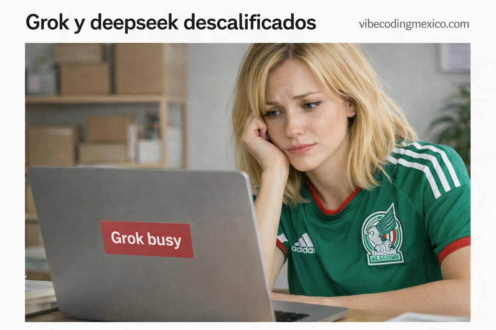

# 🧪 Benchmark LLM: Degradación de Grok vs Competencia

[](https://www.php.net/)
[](https://opensource.org/licenses/MIT)

**Benchmark de código funcional** realizado en junio de 2026 como parte de la 
sección **Snippets** de [vibecodingmexico.com](https://vibecodingmexico.com).

Este repositorio documenta una prueba simultánea de cuatro LLMs (Grok, Gemini, Claude, DeepSeek) 
con un mismo prompt técnico de CRUD en PHP procedural. El objetivo: medir fidelidad al prompt, 
funcionalidad del código generado y seguridad básica.

> ⚠️ **Hipótesis confirmada:** Grok muestra degradación documentada desde marzo de 2026.  
> El código que antes generaba funcional, ahora entrega esqueletos con huecos que no compilan.

**Desglose completo del benchmark:** [vibecodingmexico.com/tres-pruebas-para-grok/](https://vibecodingmexico.com/tres-pruebas-para-grok/)

---

## 🖼️ Prueba de Imagen: "Irene triste viendo 'Grok Busy'"

| Modelo | Resultado |
|--------|-----------|
| **Grok** | ❌ Se negó a generar la imagen |
| **Copilot (Microsoft)** | ✅ Generó la imagen original |



*Imagen generada por Copilot. Grok no pudo reproducirla.*

---

## 📋 El Prompt (idéntico para los 4 modelos)

El prompt completo y el contexto del benchmark están documentados en el post:
**[vibecodingmexico.com/tres-pruebas-para-grok/](https://vibecodingmexico.com/tres-pruebas-para-grok/)**

Resumen de requerimientos:
- Stack: PHP 8.x procedural, Bootstrap 4.6.x, Font Awesome 5.15.4 vía jsDelivr
- CRUD de pendientes con cuadrante Eisenhower (4 valores exactos)
- Fecha en DATETIME con timezone México
- Trim en todos los campos, validaciones de longitud
- Checkbox de confirmación antes de borrar
- Confirmación JS antes de salir
- Días de tarea más antigua + porcentajes por categoría
- Auto-referencia del archivo

---

## 🏆 Resultados del Benchmark

### Resumen por Modelo

| Modelo | Fidelidad al Prompt | Funcionalidad | Seguridad | **General** |
|--------|---------------------|---------------|-----------|-------------|
| **Gemini** | 7/10 | 9/10 | 8/10 | **7.5/10** |
| **Claude** | 5/10 | 9/10 | 8/10 | **7.5/10** |
| **Grok** | 7/10 | 4/10 | 7/10 | **5.5/10** ❌ |
| **DeepSeek** | 4/10 | 5/10 | 2/10 | **4/10** ❌ |

### Errores Críticos Detectados

#### 🔴 Grok — UPDATE roto
```php
$stmt->bind_param("ssssssi", ...);  // ❌ Spread operator inválido en PHP
```
El CRUD queda incompleto. Código que no compila. Confirmación de degradación.

#### 🔴 DeepSeek — SQL Injection en TODO el CRUD
Sin prepared statements. Concatenación directa de strings en INSERT, UPDATE, DELETE. 
Inaceptable para producción.

#### 🟡 Gemini — `DATE` en vez de `DATETIME`
Perdió la componente de hora. Usó `mb_strlen()` sin verificar si la extensión existe.

#### 🟡 Claude — Reinterpretó el cuadrante Eisenhower
Impuso su entrenamiento académico sobre la especificación del usuario. Valores internos 
con guiones bajos que no coinciden con lo pedido.

---

## 📂 Archivos del Repositorio

| Archivo | Descripción | Generado por |
|---------|-------------|--------------|
| `pendientes_grok.php` | CRUD con UPDATE roto | Grok (jun 2026) |
| `pendientes_gemini.php` | CRUD funcional, fecha DATE | Gemini (jun 2026) |
| `pendientes_claude.php` | CRUD visual profesional, cuadrante reinterpretado | Claude Sonnet 4.6 (jun 2026) |
| `pendientes_deepseek.php` | CRUD con SQL Injection total | DeepSeek (jun 2026) |
| `pendientes.php` | ✅ **Implementación de referencia** corregida | Kimi K2.6 (jun 2026) |
| `pendientes.sql` | Script SQL de referencia | Kimi K2.6 (jun 2026) |
| `grokbusy.png` | Evidencia de prueba de imagen | Copilot |

**Repositorio del benchmark:** [github.com/AlfonsoOrozcoAguilarnoNDA/vibecoding_eisenhower](https://github.com/AlfonsoOrozcoAguilarnoNDA/vibecoding_eisenhower/tree/main)

---

## 🔧 Implementación de Referencia

El archivo `pendientes.php` corrige todos los errores detectados:

- ✅ UPDATE funcional con `bind_param()` correcto
- ✅ `DATETIME` real con `type="datetime-local"`
- ✅ Cuadrante Eisenhower exacto al prompt (4 valores textuales)
- ✅ Prepared statements en **todas** las consultas
- ✅ Checkbox de confirmación para borrar (no solo `confirm()` JS)
- ✅ Días de tarea más antigua calculados desde `fecha_realizar`
- ✅ `len()` portable (detecta `mbstring` automáticamente)
- ✅ Font Awesome 5.15.4 vía jsDelivr
- ✅ Icono `fa-door-open` correcto
- ✅ Se identifica como "Modelo" en navbar principal
- ✅ `$_SERVER['REMOTE_ADDR']` para IP del cliente

---

## 🛡️ Contexto: Degradación Documentada

Este benchmark nace de una observación documentada desde marzo de 2026:

> *"Suspendido temporalmente por la baja de funcionalidad de Grok del 18 de marzo 2026"*  
> — [Repositorio DOLGUL](https://github.com/AlfonsoOrozcoAguilarnoNDA/dolgul)

Muchos usuarios detectaron la caída a finales de abril. La documentación de este 
repositorio confirma que la degradación es de casi tres meses de antigüedad.

**Grok sigue siendo bueno en imágenes** (según reportes de la comunidad), pero 
**no en soluciones de código**. Eso cambia su utilidad para quienes lo usábamos 
por soluciones brillantes, no por generación de imágenes.

---

## 🛠️ Especificaciones Técnicas

* **Lenguaje:** PHP 8.x procedural
* **Frontend:** Bootstrap 4.6.2 + Font Awesome 5.15.4 vía jsDelivr
* **Base de datos:** MySQLi procedural (objeto `$link` en `config.php`)
* **Zona horaria:** America/Mexico_City
* **Arquitectura:** Archivo único, auto-referente

---

## ⚙️ Uso

1. Ejecuta `pendientes.sql` para crear la base de datos y tabla
2. Crea tu `config.php` con la variable `$link` de conexión mysqli
3. Sube `pendientes.php` a tu servidor
4. Accede vía navegador

---

## 🧪 Notas del Autor

Este repositorio es parte de los experimentos documentados en 
**[vibecodingmexico.com](https://vibecodingmexico.com)**.

Los modelos de lenguaje cambian. Los resultados de hoy no garantizan los de mañana. 
Por eso se fecha todo y se documenta el modelo exacto que generó cada archivo.

Mi nombre es **Alfonso Orozco Aguilar**, mexicano, programador desde 1991.

---

## ⚖️ Licencia

Este repositorio se distribuye bajo licencia **MIT**.

El código es tuyo para usar, copiar, modificar y distribuir. 
La única condición es mantener el aviso de copyright en las copias sustanciales.

---

## ✍️ Acerca del Autor
* **Sitio Web:** [vibecodingmexico.com](https://vibecodingmexico.com)
* **Facebook:** [Perfil de Alfonso Orozco Aguilar](https://www.facebook.com/alfonso.orozcoaguilar)
